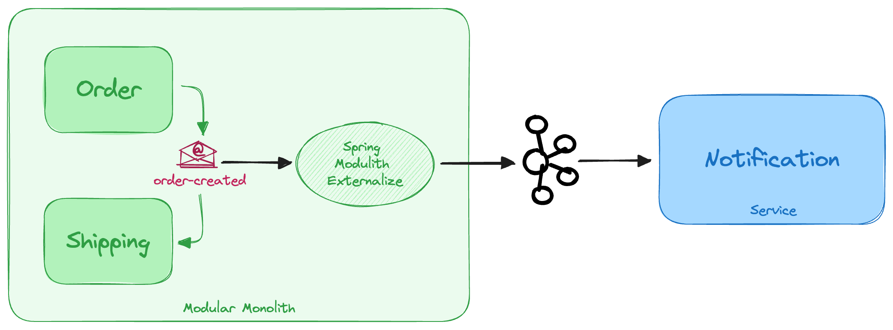
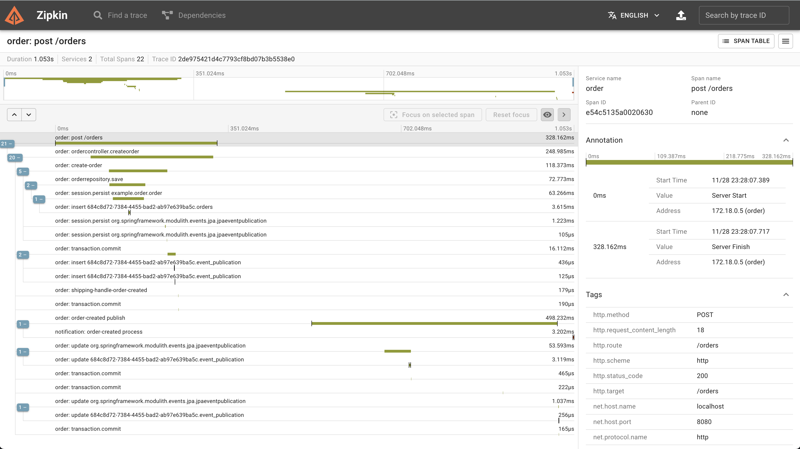

# Implementing Outbox Pattern with Spring Modulith

This project is a demonstration of Outbox pattern with Spring Modulith library using Event Externalization.

Read the accompanying blog post here: https://axual.com/implementing-outbox-pattern-with-apache-kafka-and-spring-modulith/

## Application Architecture



## Project Requirements

- JDK 21
- Spring Boot 3.2
- Docker (to run locally)

## Prepare the application

To compile and build the docker images, run below command:

```bash
mvn spring-boot:build-image
```

This will generate two docker images locally - `order:0.0.1-SNAPSHOT` and `notification:0.0.1-SNAPSHOT`.

## Run the application locally

The project comes with a docker compose file which spins up the application as well as the dependencies including Apache Kafka with kRaft and Zipkin for collecting traces. After completing the steps in "Prepare the application", run below command to start the application:

```bash
docker-compose up
```

## Run the application with Axual Kafka

Sign up for Axual Trial to obtain a Kafka cluster here: https://axual.com/trial

To run the application with a Kafka cluster from Axual, follow below steps:

1. Open the file `order/src/main/resources/application-axual.yaml` and update the SASL username and password from Axual (read the accompanying blog to understand how to obtain the credentials). Repeat the steps for the file `notification/src/main/resources/application-axual.yaml`.

   ```yaml
   spring:
     kafka:
       producer:
         properties:
           sasl:
             mechanism: SCRAM-SHA-512
             jaas:
               config: org.apache.kafka.common.security.scram.ScramLoginModule required username="<USERNAME>" password="<PASSWORD>";
   ```

2. Run below command to start the Order monolith with `axual` Spring profile:

   ```bash
   cd order
   mvn spring-boot:run -Dspring-boot.run.profiles=axual
   ```

3. Repeat the steps for Notification service and run below command to start the Notification service with `axual` Spring profile:

   ```bash
   cd notification
   mvn spring-boot:run -Dspring-boot.run.profiles=axual
   ```

4. Trigger the order creation flow with below command:
   ```bash
   curl -X POST http://localhost:8080/orders -d "product=Coffee"
   ```

## View Traces

Open Zipkin in browser at http://localhost:9411 and view the trace.



## Logs sample

Inspect the logs to see how transactions are created and committed, Shipping module kicks into action via the published event within the JVM and Notification is triggered via the published event in Kafka.

```text
2023-11-28T22:28:07.484Z DEBUG 1 --- [order] [nio-8080-exec-1] o.s.orm.jpa.JpaTransactionManager        : Creating new transaction with name [example.order.OrderManagement.create]: PROPAGATION_REQUIRED,ISOLATION_DEFAULT
2023-11-28T22:28:07.485Z DEBUG 1 --- [order] [nio-8080-exec-1] o.s.orm.jpa.JpaTransactionManager        : Opened new EntityManager [SessionImpl(1079008876<open>)] for JPA transaction
2023-11-28T22:28:07.489Z DEBUG 1 --- [order] [nio-8080-exec-1] o.s.orm.jpa.JpaTransactionManager        : Exposing JPA transaction as JDBC [org.springframework.orm.jpa.vendor.HibernateJpaDialect$HibernateConnectionHandle@726397f3]
2023-11-28T22:28:07.501Z DEBUG 1 --- [order] [nio-8080-exec-1] o.s.orm.jpa.JpaTransactionManager        : Found thread-bound EntityManager [SessionImpl(1079008876<open>)] for JPA transaction
2023-11-28T22:28:07.502Z DEBUG 1 --- [order] [nio-8080-exec-1] o.s.orm.jpa.JpaTransactionManager        : Participating in existing transaction
Hibernate: insert into orders (product,status,id) values (?,?,default)
2023-11-28T22:28:07.575Z DEBUG 1 --- [order] [nio-8080-exec-1] o.s.orm.jpa.JpaTransactionManager        : Found thread-bound EntityManager [SessionImpl(1079008876<open>)] for JPA transaction
2023-11-28T22:28:07.575Z DEBUG 1 --- [order] [nio-8080-exec-1] o.s.orm.jpa.JpaTransactionManager        : Participating in existing transaction
2023-11-28T22:28:07.614Z DEBUG 1 --- [order] [nio-8080-exec-1] o.s.orm.jpa.JpaTransactionManager        : Found thread-bound EntityManager [SessionImpl(1079008876<open>)] for JPA transaction
2023-11-28T22:28:07.614Z DEBUG 1 --- [order] [nio-8080-exec-1] o.s.orm.jpa.JpaTransactionManager        : Participating in existing transaction
2023-11-28T22:28:07.617Z  INFO 1 --- [order] [nio-8080-exec-1] example.order.OrderManagement            : Order created
2023-11-28T22:28:07.617Z DEBUG 1 --- [order] [nio-8080-exec-1] o.s.orm.jpa.JpaTransactionManager        : Initiating transaction commit
2023-11-28T22:28:07.617Z DEBUG 1 --- [order] [nio-8080-exec-1] o.s.orm.jpa.JpaTransactionManager        : Committing JPA transaction on EntityManager [SessionImpl(1079008876<open>)]
Hibernate: insert into event_publication (completion_date,event_type,listener_id,publication_date,serialized_event,id) values (?,?,?,?,?,?)
Hibernate: insert into event_publication (completion_date,event_type,listener_id,publication_date,serialized_event,id) values (?,?,?,?,?,?)
2023-11-28T22:28:07.636Z DEBUG 1 --- [order] [         task-1] o.s.orm.jpa.JpaTransactionManager        : Creating new transaction with name [example.shipping.Shipping.on]: PROPAGATION_REQUIRES_NEW,ISOLATION_DEFAULT
2023-11-28T22:28:07.637Z DEBUG 1 --- [order] [         task-1] o.s.orm.jpa.JpaTransactionManager        : Opened new EntityManager [SessionImpl(376857564<open>)] for JPA transaction
2023-11-28T22:28:07.637Z DEBUG 1 --- [order] [         task-1] o.s.orm.jpa.JpaTransactionManager        : Exposing JPA transaction as JDBC [org.springframework.orm.jpa.vendor.HibernateJpaDialect$HibernateConnectionHandle@18b19f62]
2023-11-28T22:28:07.639Z  INFO 1 --- [order] [         task-1] example.shipping.Shipping                : Started shipping for order 1
2023-11-28T22:28:07.639Z DEBUG 1 --- [order] [         task-1] o.s.orm.jpa.JpaTransactionManager        : Initiating transaction commit
2023-11-28T22:28:07.639Z DEBUG 1 --- [order] [         task-1] o.s.orm.jpa.JpaTransactionManager        : Committing JPA transaction on EntityManager [SessionImpl(376857564<open>)]
2023-11-28T22:28:07.640Z DEBUG 1 --- [order] [         task-1] o.s.orm.jpa.JpaTransactionManager        : Closing JPA EntityManager [SessionImpl(376857564<open>)] after transaction
2023-11-28T22:28:07.640Z DEBUG 1 --- [order] [         task-1] o.s.orm.jpa.JpaTransactionManager        : Creating new transaction with name [org.springframework.modulith.events.core.DefaultEventPublicationRegistry.markCompleted]: PROPAGATION_REQUIRES_NEW,ISOLATION_DEFAULT
2023-11-28T22:28:07.641Z DEBUG 1 --- [order] [         task-1] o.s.orm.jpa.JpaTransactionManager        : Opened new EntityManager [SessionImpl(1179890726<open>)] for JPA transaction
2023-11-28T22:28:07.641Z DEBUG 1 --- [order] [         task-1] o.s.orm.jpa.JpaTransactionManager        : Exposing JPA transaction as JDBC [org.springframework.orm.jpa.vendor.HibernateJpaDialect$HibernateConnectionHandle@228725d6]
2023-11-28T22:28:07.641Z DEBUG 1 --- [order] [         task-1] o.s.orm.jpa.JpaTransactionManager        : Found thread-bound EntityManager [SessionImpl(1179890726<open>)] for JPA transaction
2023-11-28T22:28:07.641Z DEBUG 1 --- [order] [         task-1] o.s.orm.jpa.JpaTransactionManager        : Participating in existing transaction
2023-11-28T22:28:07.642Z DEBUG 1 --- [order] [         task-2] o.s.orm.jpa.JpaTransactionManager        : Creating new transaction with name [org.springframework.modulith.events.support.DelegatingEventExternalizer.externalize]: PROPAGATION_REQUIRES_NEW,ISOLATION_DEFAULT
2023-11-28T22:28:07.642Z DEBUG 1 --- [order] [         task-2] o.s.orm.jpa.JpaTransactionManager        : Opened new EntityManager [SessionImpl(2064712783<open>)] for JPA transaction
2023-11-28T22:28:07.642Z DEBUG 1 --- [order] [         task-2] o.s.orm.jpa.JpaTransactionManager        : Exposing JPA transaction as JDBC [org.springframework.orm.jpa.vendor.HibernateJpaDialect$HibernateConnectionHandle@75d6f55d]
2023-11-28T22:28:07.653Z DEBUG 1 --- [order] [nio-8080-exec-1] o.s.orm.jpa.JpaTransactionManager        : Closing JPA EntityManager [SessionImpl(1079008876<open>)] after transaction
2023-11-28T22:28:07.728Z  INFO 1 --- [order] [         task-2] o.a.k.clients.producer.ProducerConfig    : ProducerConfig values:
acks = -1
auto.include.jmx.reporter = true
batch.size = 16384
bootstrap.servers = [kafka:9092]
buffer.memory = 33554432
client.dns.lookup = use_all_dns_ips
client.id = producer-1
compression.type = none
connections.max.idle.ms = 540000
delivery.timeout.ms = 120000
enable.idempotence = true
interceptor.classes = []
key.serializer = class org.apache.kafka.common.serialization.StringSerializer
linger.ms = 0
max.block.ms = 60000
max.in.flight.requests.per.connection = 5
max.request.size = 1048576
metadata.max.age.ms = 300000
metadata.max.idle.ms = 300000
metric.reporters = [io.opentelemetry.javaagent.shaded.instrumentation.kafka.internal.OpenTelemetryMetricsReporter]
metrics.num.samples = 2
metrics.recording.level = INFO
metrics.sample.window.ms = 30000
partitioner.adaptive.partitioning.enable = true
partitioner.availability.timeout.ms = 0
partitioner.class = null
partitioner.ignore.keys = false
receive.buffer.bytes = 32768
reconnect.backoff.max.ms = 1000
reconnect.backoff.ms = 50
request.timeout.ms = 30000
retries = 2147483647
retry.backoff.ms = 100
sasl.client.callback.handler.class = null
sasl.jaas.config = null
sasl.kerberos.kinit.cmd = /usr/bin/kinit
sasl.kerberos.min.time.before.relogin = 60000
sasl.kerberos.service.name = null
sasl.kerberos.ticket.renew.jitter = 0.05
sasl.kerberos.ticket.renew.window.factor = 0.8
sasl.login.callback.handler.class = null
sasl.login.class = null
sasl.login.connect.timeout.ms = null
sasl.login.read.timeout.ms = null
sasl.login.refresh.buffer.seconds = 300
sasl.login.refresh.min.period.seconds = 60
sasl.login.refresh.window.factor = 0.8
sasl.login.refresh.window.jitter = 0.05
sasl.login.retry.backoff.max.ms = 10000
sasl.login.retry.backoff.ms = 100
sasl.mechanism = GSSAPI
sasl.oauthbearer.clock.skew.seconds = 30
sasl.oauthbearer.expected.audience = null
sasl.oauthbearer.expected.issuer = null
sasl.oauthbearer.jwks.endpoint.refresh.ms = 3600000
sasl.oauthbearer.jwks.endpoint.retry.backoff.max.ms = 10000
sasl.oauthbearer.jwks.endpoint.retry.backoff.ms = 100
sasl.oauthbearer.jwks.endpoint.url = null
sasl.oauthbearer.scope.claim.name = scope
sasl.oauthbearer.sub.claim.name = sub
sasl.oauthbearer.token.endpoint.url = null
security.protocol = PLAINTEXT
security.providers = null
send.buffer.bytes = 131072
socket.connection.setup.timeout.max.ms = 30000
socket.connection.setup.timeout.ms = 10000
ssl.cipher.suites = null
ssl.enabled.protocols = [TLSv1.2, TLSv1.3]
ssl.endpoint.identification.algorithm = https
ssl.engine.factory.class = null
ssl.key.password = null
ssl.keymanager.algorithm = SunX509
ssl.keystore.certificate.chain = null
ssl.keystore.key = null
ssl.keystore.location = null
ssl.keystore.password = null
ssl.keystore.type = JKS
ssl.protocol = TLSv1.3
ssl.provider = null
ssl.secure.random.implementation = null
ssl.trustmanager.algorithm = PKIX
ssl.truststore.certificates = null
ssl.truststore.location = null
ssl.truststore.password = null
ssl.truststore.type = JKS
transaction.timeout.ms = 60000
transactional.id = null
value.serializer = class org.springframework.kafka.support.serializer.JsonSerializer

2023-11-28T22:28:07.790Z  INFO 1 --- [order] [         task-2] o.a.k.clients.producer.KafkaProducer     : [Producer clientId=producer-1] Instantiated an idempotent producer.
2023-11-28T22:28:07.864Z  INFO 1 --- [order] [         task-2] o.a.kafka.common.utils.AppInfoParser     : Kafka version: 3.6.0
2023-11-28T22:28:07.864Z  INFO 1 --- [order] [         task-2] o.a.kafka.common.utils.AppInfoParser     : Kafka commitId: 60e845626d8a465a
2023-11-28T22:28:07.864Z  INFO 1 --- [order] [         task-2] o.a.kafka.common.utils.AppInfoParser     : Kafka startTimeMs: 1701210487862
Hibernate: update event_publication set completion_date=? where serialized_event=? and listener_id=?
2023-11-28T22:28:08.111Z DEBUG 1 --- [order] [         task-1] o.s.orm.jpa.JpaTransactionManager        : Initiating transaction commit
2023-11-28T22:28:08.111Z DEBUG 1 --- [order] [         task-1] o.s.orm.jpa.JpaTransactionManager        : Committing JPA transaction on EntityManager [SessionImpl(1179890726<open>)]
2023-11-28T22:28:08.112Z DEBUG 1 --- [order] [         task-1] o.s.orm.jpa.JpaTransactionManager        : Closing JPA EntityManager [SessionImpl(1179890726<open>)] after transaction
2023-11-28T22:28:08.276Z  INFO 1 --- [order] [ad | producer-1] org.apache.kafka.clients.Metadata        : [Producer clientId=producer-1] Cluster ID: ZekNCzuTQYWyzIc6I7IL4A
2023-11-28T22:28:08.297Z DEBUG 1 --- [order] [         task-2] o.s.orm.jpa.JpaTransactionManager        : Initiating transaction commit
2023-11-28T22:28:08.297Z DEBUG 1 --- [order] [         task-2] o.s.orm.jpa.JpaTransactionManager        : Committing JPA transaction on EntityManager [SessionImpl(2064712783<open>)]
2023-11-28T22:28:08.298Z DEBUG 1 --- [order] [         task-2] o.s.orm.jpa.JpaTransactionManager        : Closing JPA EntityManager [SessionImpl(2064712783<open>)] after transaction
2023-11-28T22:28:08.389Z  INFO 1 --- [order] [ad | producer-1] o.a.k.c.p.internals.TransactionManager   : [Producer clientId=producer-1] ProducerId set to 1000 with epoch 0
2023-11-28T22:28:08.409Z DEBUG 1 --- [order] [ad | producer-1] o.s.orm.jpa.JpaTransactionManager        : Creating new transaction with name [org.springframework.modulith.events.core.DefaultEventPublicationRegistry.markCompleted]: PROPAGATION_REQUIRES_NEW,ISOLATION_DEFAULT
2023-11-28T22:28:08.409Z DEBUG 1 --- [order] [ad | producer-1] o.s.orm.jpa.JpaTransactionManager        : Opened new EntityManager [SessionImpl(1733199947<open>)] for JPA transaction
2023-11-28T22:28:08.409Z DEBUG 1 --- [order] [ad | producer-1] o.s.orm.jpa.JpaTransactionManager        : Exposing JPA transaction as JDBC [org.springframework.orm.jpa.vendor.HibernateJpaDialect$HibernateConnectionHandle@40df17e5]
2023-11-28T22:28:08.409Z DEBUG 1 --- [order] [ad | producer-1] o.s.orm.jpa.JpaTransactionManager        : Found thread-bound EntityManager [SessionImpl(1733199947<open>)] for JPA transaction
2023-11-28T22:28:08.409Z DEBUG 1 --- [order] [ad | producer-1] o.s.orm.jpa.JpaTransactionManager        : Participating in existing transaction
Hibernate: update event_publication set completion_date=? where serialized_event=? and listener_id=?
2023-11-28T22:28:08.411Z DEBUG 1 --- [order] [ad | producer-1] o.s.orm.jpa.JpaTransactionManager        : Initiating transaction commit
2023-11-28T22:28:08.411Z DEBUG 1 --- [order] [ad | producer-1] o.s.orm.jpa.JpaTransactionManager        : Committing JPA transaction on EntityManager [SessionImpl(1733199947<open>)]
2023-11-28T22:28:08.411Z DEBUG 1 --- [order] [ad | producer-1] o.s.orm.jpa.JpaTransactionManager        : Closing JPA EntityManager [SessionImpl(1733199947<open>)] after transaction
```
